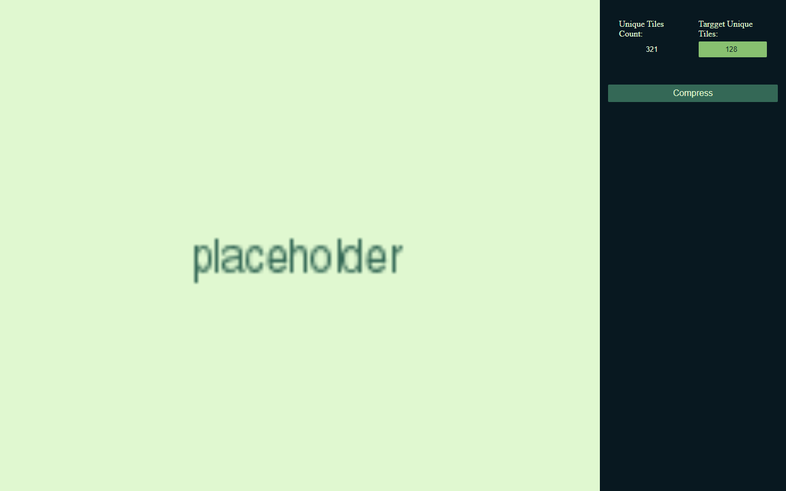

#  Tilepressor

map/image compressor for 2D tile-based images, games, and engines



## Live Demo

[Live Demo Link](https://juanlpalacios.github.io/Tilepressor/)

### Features

- Background Process compression
- Batch image tile compression
- Indexed palette filter
- Indexed palette filter

### Installation
open the [Live Demo Link](https://juanlpalacios.github.io/Tilepressor/) and press the install button in the url bar or options on mobile
### Setup


to set it up you have to first run 

```
npm install
```

after that, you can run the local development server with:
```
npm run dev
```

is highly recommended to run the TypeScript compiler in a second terminal to check for type errors:
```
npm run tsc
```

then you can build and test the PWA behaviors with with:
```
npm run build
npm run preview
```

## Built With

- React
- TypeScript
- Tailwind
- Vite
- FileSaver.js
- JSZip

## Author

👤 **Juan Luis Palacios**

- GitHub: [@JuanLPalacios](https://github.com/JuanLPalacios)
- Twitter: [@JuanLuisPalac20](https://twitter.com/twitterhandle)
- LinkedIn: [LinkedIn](https://www.linkedin.com/in/juan-luis-palacios-p%C3%A9rez-95b39a228/)


## 🤝 Contributing

Contributions, issues, and feature requests are welcome!

Feel free to check the [issues page](../../issues/).

## Show your support

Give a ⭐️ if you like this project!
or If you appreciate my work, consider buying me a coffee as a gesture of support.

[](https://www.buymeacoffee.com/juanluispap)

## 📝 License

This project is [MIT](./MIT.md) licensed.
